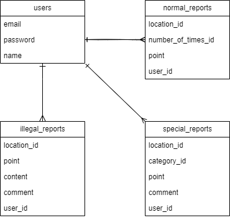
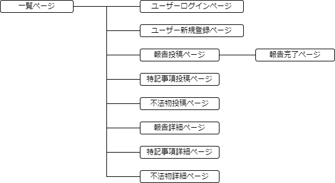

# アプリケーション名
Clean Up
# アプリケーション概要
ごみ収集業において、収集終了地点を画像付きで報告することができ、報告時のコミュニケーションエラーを防ぐことができる。
# URL
https://clean-up.onrender.com/
# テスト用アカウント
- Basic認証ID：admin
- Basic認証パスワード：4863
- メールアドレス：asd@a
- パスワード：a1s2d3
# 利用方法
## 報告投稿
1. トップページ（一覧ページ）のヘッダーからユーザー新規登録を行う
1. 各種報告投稿ボタンから、内容を入力し投稿する。
   1. 報告：収集地域、回転数、終了地点、写真
   1. 特記事項：収集地域、種別、地点、補足事項、写真
   1. 不法物：収集地域、地点、内容物、補足事項、写真
# アプリケーションを作成した背景
現職のゴミ収集業務において、収集終了地点の報告が電話越しの口頭であるため伝達ミスによる、ごみの取り残しなどが課題としてあった。課題を分析した結果「報告が口頭のみであること」と「報告を受けた者が他に共有する手段も口頭であり、そこでも伝達ミスが生じる可能性があること」が原因であると仮説を立てた。原因を解決するために、報告に任意で写真を添付することができ、社員が誰でも閲覧できるメッセージ投稿アプリケーションを開発することにした。
# 洗い出した要件
[要件定義シート](https://docs.google.com/spreadsheets/d/1bhKHserZV7ryiCxTLbYVS-Zs2EiDWADykEnILe1jrFA/edit?usp=sharing)
# 実装した機能についての画像やGIFおよびその説明
- 報告を投稿すると投稿完了画面に遷移し、特記事項投稿フォームに遷移するかを選択できる。（GIF）

- 投稿すると一覧画面に表示される(画像)

- 一覧画面の投稿をクリックすると詳細画面に遷移する(GIF)

- 詳細画面の「編集する」ボタンをクリックすると編集ページに遷移する
(GIF)

- 投稿内容を変更すると、変更が適用され詳細画面に遷移する(GIF)

# 実装予定の機能
今後、チェック機能を実装予定。
# データベース設計

# 画面遷移図

# 開発環境
Ruby/Ruby on Rails/MySQL/Github/Visual Studio Code
# ローカルでの動作方法
以下のコマンドを順に実行。  
% git clone https://github.com/nakamu26/clean-up.git  
% cd clean-up  
% bundle install  
% yarn instal
# 工夫したポイント
- 特記事項を投稿するタイミングは報告を投稿するタイミングと重なるため、報告を投稿したら「投稿完了画面」に遷移させ、
特記事項投稿フォームに遷移するかを選択させることで利便性の向上を図った。
これは同時に、報告のみ投稿し、特記事項の投稿を忘れてしまうことを防止する役割も担う。
- 投稿内容は基本的に当日分が見られれば良いので、一覧ページに表示する投稿はwhereメソッドにより当日分のみ取得するようにした。
- 一覧に表示される情報のみでも十全に情報伝達できる場合が多いが、補足するために写真や補足事項を付加されていることを
閲覧者が見落とさないように、写真や補足事項がある場合は赤字で強調するようにした。